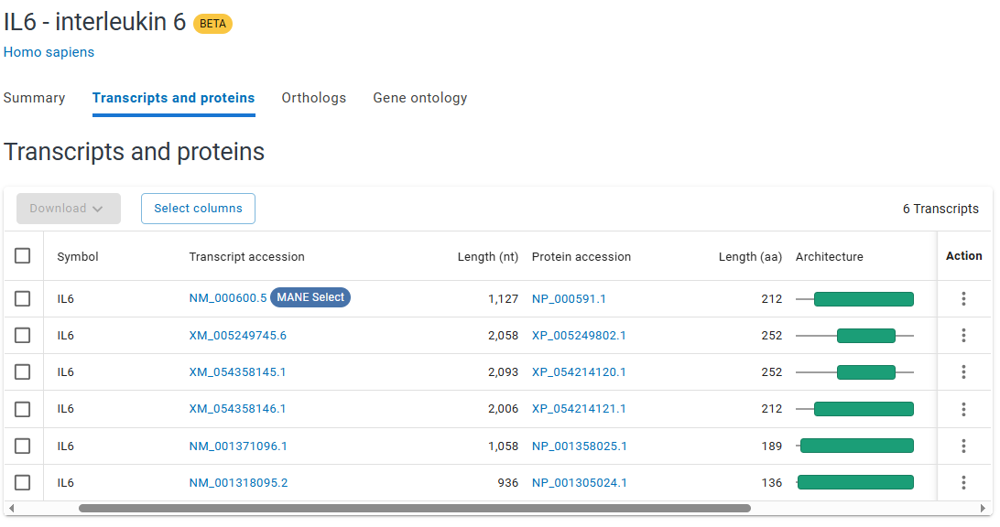
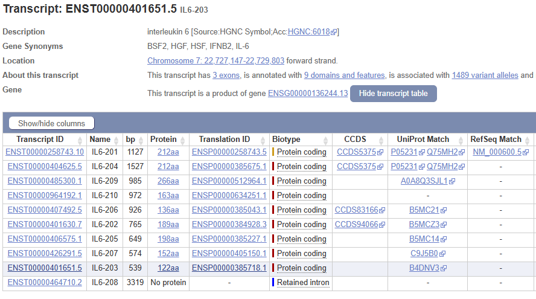
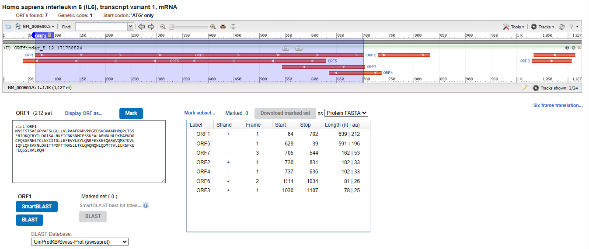

# Gene Analysis - Interleukin 6 (IL6) _Homo sapiens_

## Gene Overview
Interleukin 6 (IL6) is a cytokine involved in immune regulation, inflammation, infection response, and hematopoiesis. It plays important roles in inflammatory diseases, cancer, autoimmune conditions, and cytokine storm responses.

I selected IL6 because of its strong relevance to immunology, infectious disease, and computational epidemiology.

## Databases Used
NCBI, Ensembl, UniProt

## Database Annotation Differences
NCBI reported **6** transcript variants while Ensembl reported **10** transcripts for IL6.

This difference likely results from differences in annotation pipelines, evidence thresholds, and transcript prediction strategies between databases.

## Canonical Transcript
A canonical transcript is the representative transcript selected by a database for a gene often based on protein length, expression or biological relevance. The canonical transcript identified across databases included:

- **NCBI RefSeq:** NM_000600.5
- **Ensembl Transcript:** ENST00000258743
- **UniProt Protein:** P05231

The **MANE** Select transcript was consistent across NCBI and Ensembl, suggesting a very strong annotation agreement.

**NOTE** - Different transcript variants may produce distinct protein isoforms or may differ only in untranslated regions (UTRs) while encoding the same protein sequence.

## ORF Exploration

ORF Finder identified **7** potential open reading frames (ORFs) within the nucleotide sequence.

ORF prediction tools help in identifying possible coding regions based on start and stop codons, but not all predicted ORFs are biologically expressed.

## Skills Practiced
- Database exploration
- Transcript annotation comparison
- Cross-database validation
- Biological interpretation
- Sequence annotation analysis
